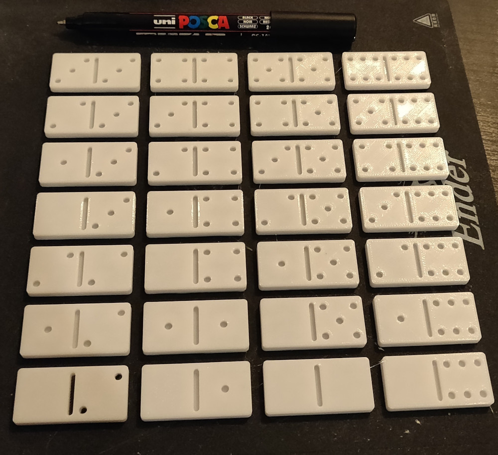
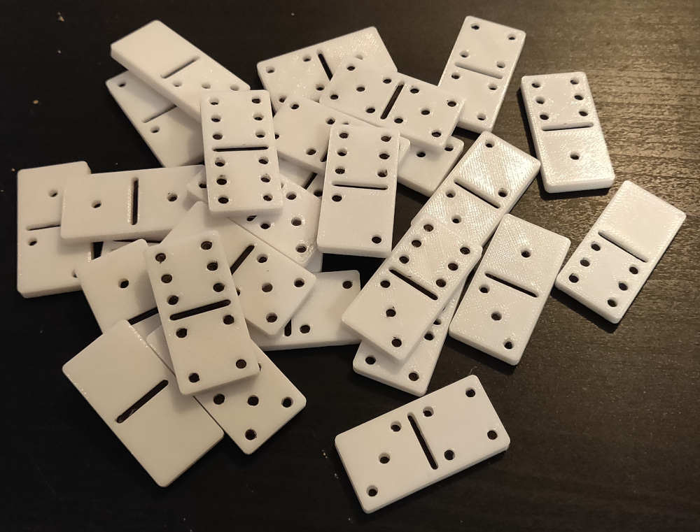

# Dominos

Simple 2cm dominos.

## Print Setting

- Printer brand: Creality
- Printer: Ender 3
- Rafts: No
- Supports: No
- Resolution: 0.2mm
- Infill: 20
- Filament brand: Enotepad
- Filament color: White
- Filament material: PLA

## Notes/Tips

I used a 0.7mm black POSCA to color dots.

## Photos

## Links

- [https://www.thingiverse.com/thing:5185465]()