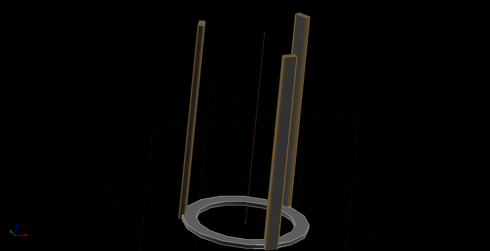
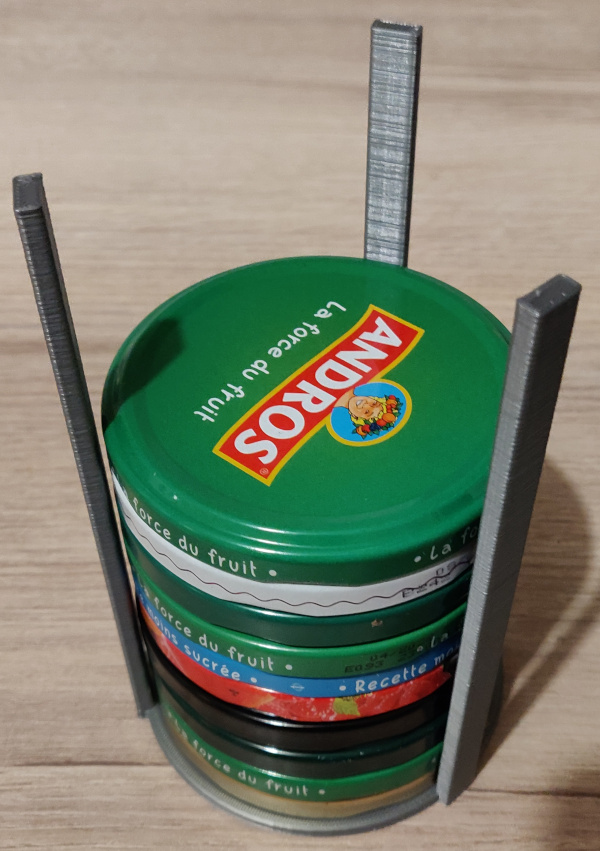
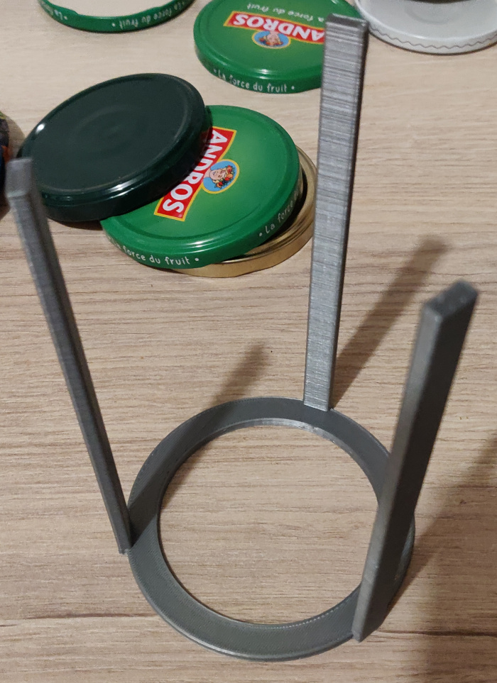

# Jar cover tower

Simple three arms tower to keep jar cover tidy.

I design it for 83mm jar cover. Can hold around 15 jar covers.

## Print Setting

- Printer brand: Creality
- Printer: Ender 3
- Rafts: Yes
- Supports: Yes
- Resolution: 0.3mm
- Infill: 20
- Filament brand: Amazon Basics
- Filament color: Grey
- Filament material: PLA

## Photos

## Links

- [https://www.thingiverse.com/thing:4861867]()