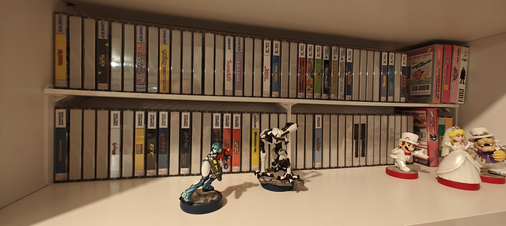
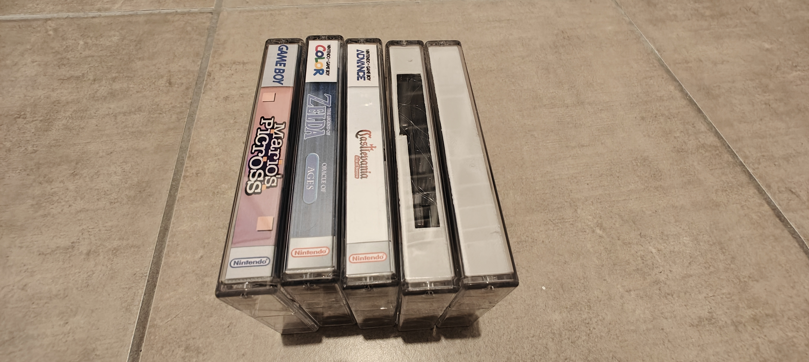
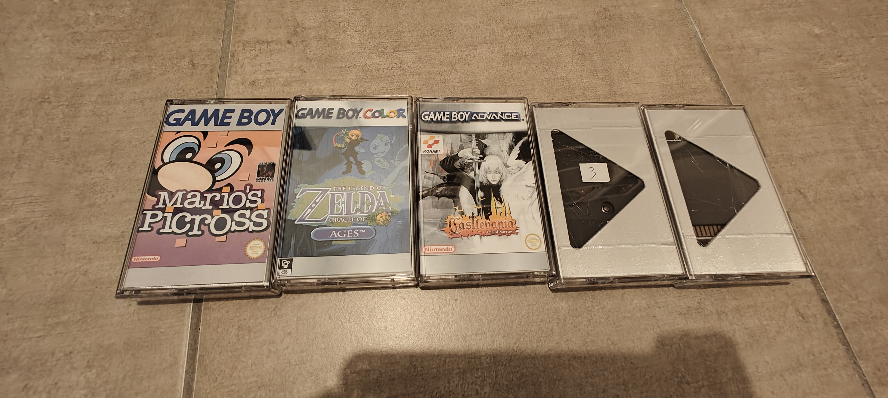
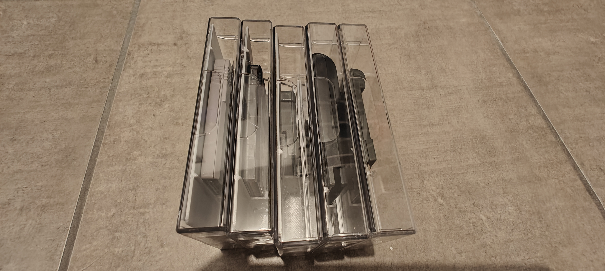
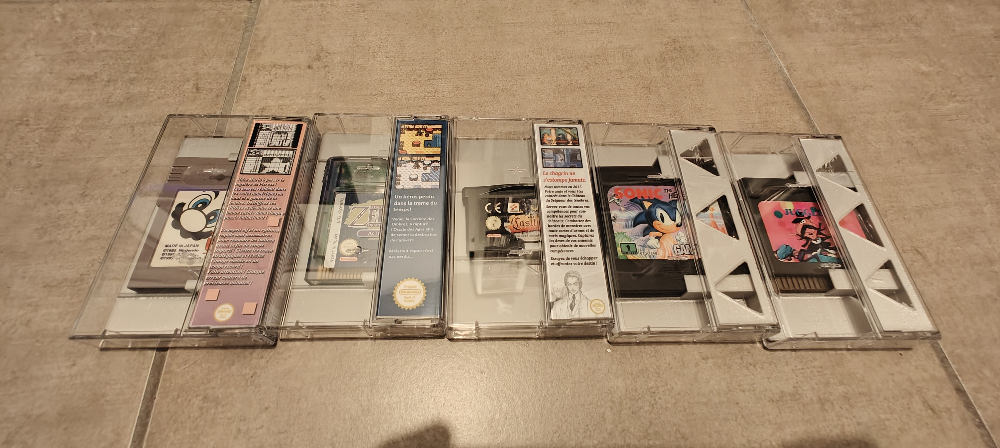
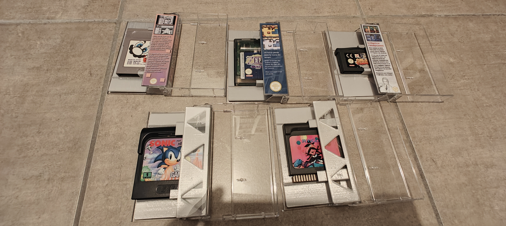
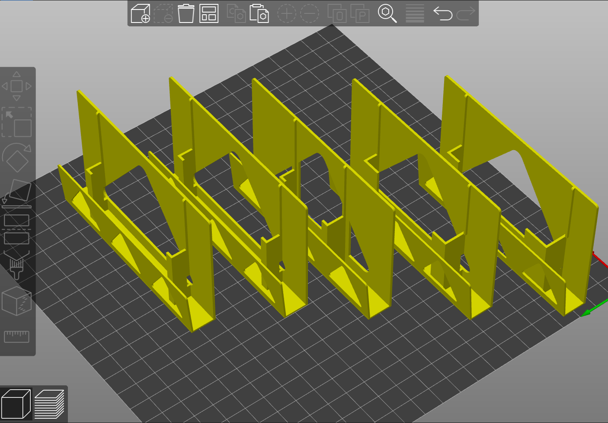
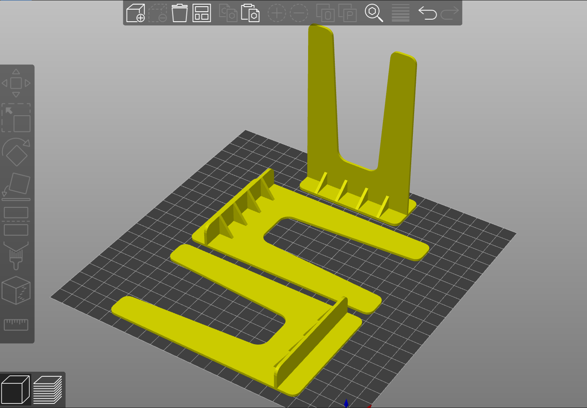

# K7 insert

Lightweight K7 insert for video game cartridges

Heavily inspired by the work of [NaoNack](https://www.thingiverse.com/naonack/collections/37710871/things)

## Print Setting

- Printer brand: Creality
- Printer: Ender 3
- Rafts: No
- Supports: No
- Resolution: 0.3mm
- Infill: 20
- Filament brand: Amazon Basics
- Filament color: Grey
- Filament material: PLA

## Notes/Tips

- I made these after some try with NaoNack models
  - NaoNack GB model was estimate by PrusaSlicer at 2h19 of printing time and 26.25g of PLA
  - mine 1h26 (-38%) and 11.08g of PLA (-58%)
  - NaoNack model is heavier but also really stronger, it will protect more cartridge, on my side a prioritize printing speed and cost
- my model is thought to be printed with a resolution of 0.30mm to minimize printer head moves
- my model is made for this case: https://www.planetedisque.com/fr/boitier-et-pochette-k7/52-10-boitiers-k7-cassette-deluxe-transparent-6096420469491.html (it seems slightly smaller than standard ones)
- cover can be found [here](https://app.mediafire.com/995869a3b2882) or [here](https://www.thecoverproject.net/view.php?cover_id=22567)

## Photos

## Links

- [https://www.thingiverse.com/thing:6325389](https://www.thingiverse.com/thing:6325389)
- More photos and build path here: https://x.com/_Anthony_Pena/status/1710266028284891417?s=20
