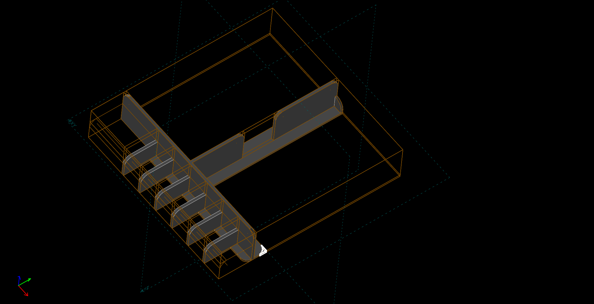
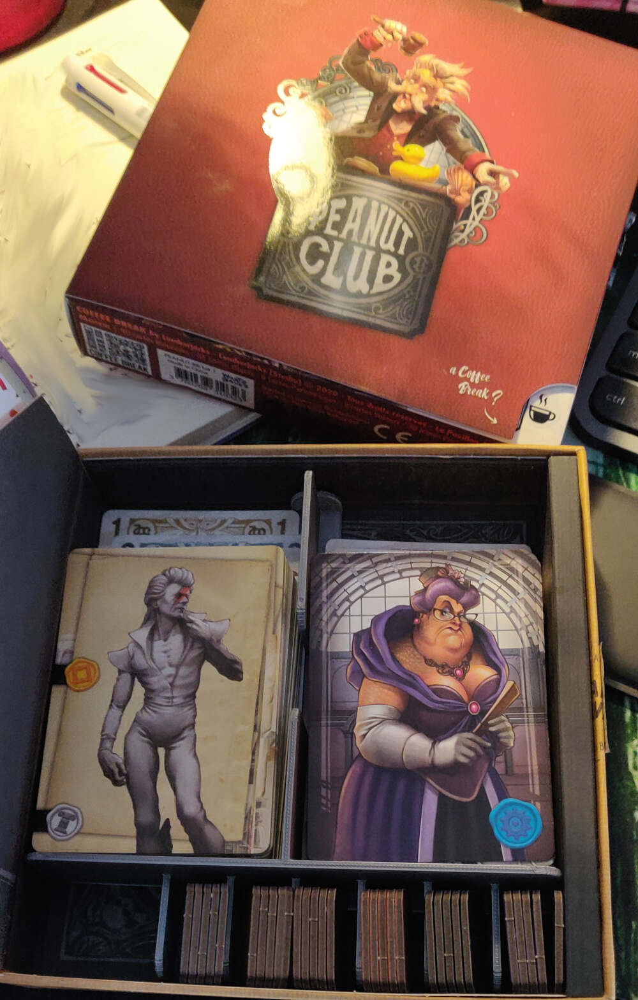

# Peanut Club box insert

Simple box insert to tidy cards and tokens.

## Print Setting

- Printer brand: Creality
- Printer: Ender 3
- Rafts: No
- Supports: No
- Resolution: 0.3mm
- Infill: 20
- Filament brand: Amazon Basics
- Filament color: Grey
- Filament material: PLA
- Notes:
- Tips:

## Photos

## Links

- [https://www.thingiverse.com/thing:4861798]()
