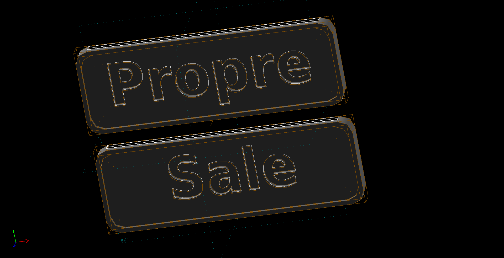
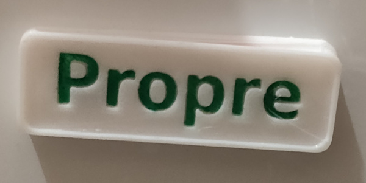
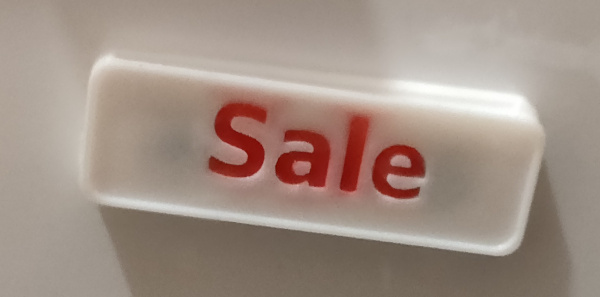

# Propre/Sale dishwasher magnet

Indicator to know if dishwasher content is clean (in french "Propre") or dirty (in french "Dirty").

The indicator is a magnet, and need two 8x3mm circular magnet.

## Print Setting

- Printer brand: Creality
- Printer: Ender 3
- Rafts: No
- Supports: No
- Resolution: 0.3mm
- Infill: 20
- Filament brand: Amazon Basics
- Filament color: White
- Filament material: PLA

## Notes/Tips

To have clean text, I made the model in two part (one for each face). After printing it you can glue the two magnet, then glue both side together. You can fill text with color paint like me to have really readable text.

## Photos

## Links

- [https://www.thingiverse.com/thing:4861848]()
- [8x3mm circular magnets](https://www.amazon.fr/gp/product/B07JHQNDZC/ref=ppx_yo_dt_b_search_asin_title?ie=UTF8&psc=1)
- [Posca pens (for painting text)](https://www.amazon.fr/gp/product/B076MWFG1Z/ref=ppx_yo_dt_b_search_asin_title?ie=UTF8&psc=1)
